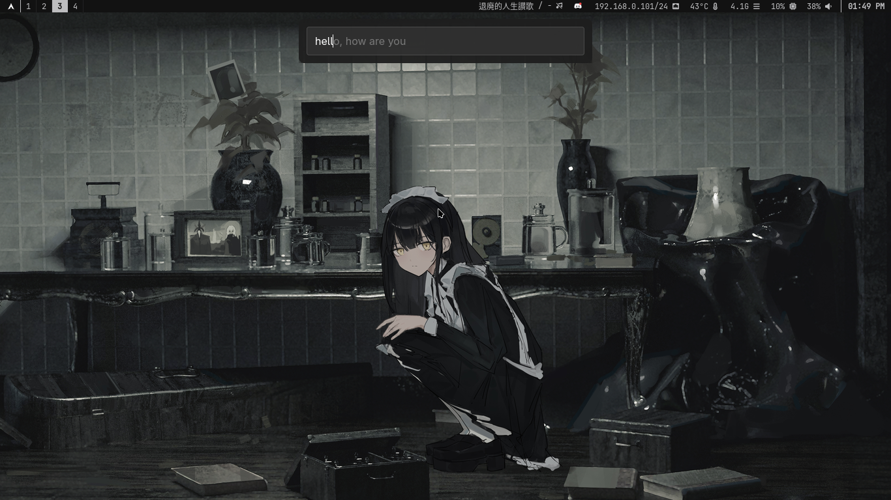

# GTK4 TTS Overlay



A sleek, lightweight GTK4 Layer Shell overlay and background daemon that provides instant Text-to-Speech (TTS) capabilities anywhere on your desktop. Powered by [KittenTTS](https://huggingface.co/KittenML) (`kitten-tts-nano-0.8`), it allows you to quickly type text and have it spoken out loud.

## Features

- **Instant & Seamless**: The background daemon keeps the AI model loaded in memory for zero-latency speech generation.
- **Always on Top**: Built with GTK4 Layer Shell to sit gracefully on top of all your windows (like a launcher or panel).
- **Highly Configurable**: Change ALSA playback devices, select different voices, and configure window anchors and margins.
- **Unix Domain Sockets**: Fast, local, and reliable IPC between the GUI and the background audio service.

## Setup

> **Note:** This application is **Linux-only**, as it relies on GTK4 Layer Shell (Wayland) and ALSA/PipeWire/PulseAudio for audio.

### System Dependencies

Before running, you must install the following system-level packages depending on your Linux distribution:
- `libasound` (ALSA library required for audio routing)
- `alsa-plugins` (Crucial for PulseAudio/PipeWire compatibility, specifically for the `module-null-sink`)
- `gtk4` (The core UI toolkit)
- `libgtk4-layer-shell` (Required for the overlay window on Wayland)

### Python Dependencies

This project uses `uv` for fast dependency management, as defined in `pyproject.toml`. 

To easily set up a virtual environment and install all required Python packages (such as PyGObject, Gtk4LayerShell, and pyalsaaudio), simply run:
```bash
uv venv
uv sync
```

Then, activate the virtual environment:
```bash
source .venv/bin/activate
```

Before running the TTS daemon for the first time, you can optionally populate the chat abbreviation/slang dataset:
```bash
python load_clean_save.py
```

## Usage

The application is split into two parts: a **Daemon** that manages the loaded AI model and audio playback queue, and a **GUI Client** that accepts your input.

### 1. Start the Background Daemon

Before using the GUI, you must start the daemon. It will listen in the background for incoming text:

```bash
python main.py -d
```

**Daemon Options:**
- `--device <name>`: Specify the ALSA playback device (e.g., `pipewire`, `pulse`, `default`). Defaults to `pipewire`.
- `--voice <name>`: Choose the TTS voice. Defaults to `Rosie`.
- `--virtual`: Automatically load a virtual null PulseAudio sink (`TTS_Virtual_Sink`) and route audio output to `pulse:TTS_Virtual_Sink`, automatically unloading the module when the daemon exits.
- `--feedback`: Enables local audio feedback by creating a PulseAudio loopback module from `TTS_Virtual_Sink.monitor` to `@DEFAULT_SINK@` (implicitly enables `--virtual`).

Example:
```bash
python main.py -d --virtual --feedback --voice Hugo
```

### 2. Launch the GUI Overlay

With the daemon running, open the GUI client to start typing:

```bash
python main.py
```
*Tip: Map this command to a global keyboard shortcut in your window manager (e.g. Sway, Hyprland, GNOME) for instant access.*

**GUI Positioning Options:**
You can adjust where the overlay appears on your screen using flags:
- `--anchor-top` (default) / `--no-anchor-top`
- `--anchor-bottom` / `--anchor-left` / `--anchor-right`
- `--margin-top`, `--margin-bottom`, `--margin-left`, `--margin-right`

### 3. List Available Voices

Want to see what voices are available? Run:
```bash
python main.py --list-voices
```

## How to use the Overlay
- **Type text**: Type the phrase you want to be spoken.
- **Enter**: Sends the text to the daemon to be spoken immediately and clears the text box so you can keep typing.
- **Esc**: Closes the overlay.
